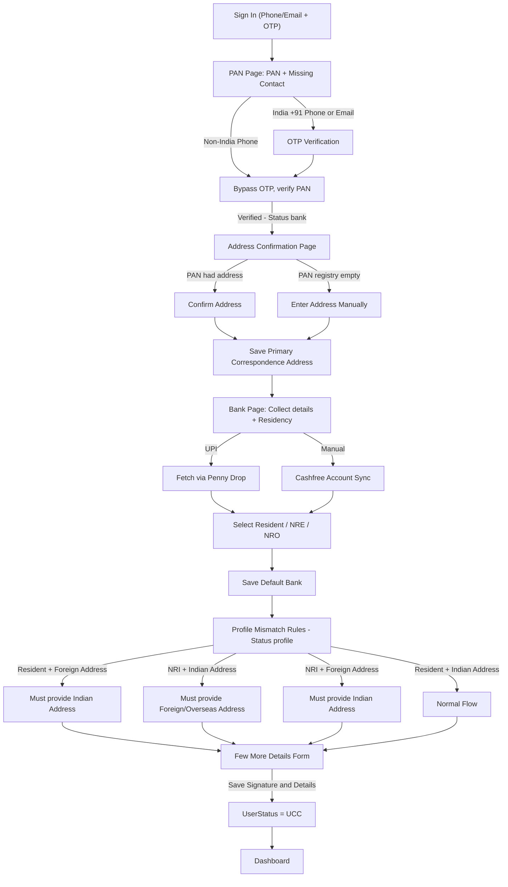
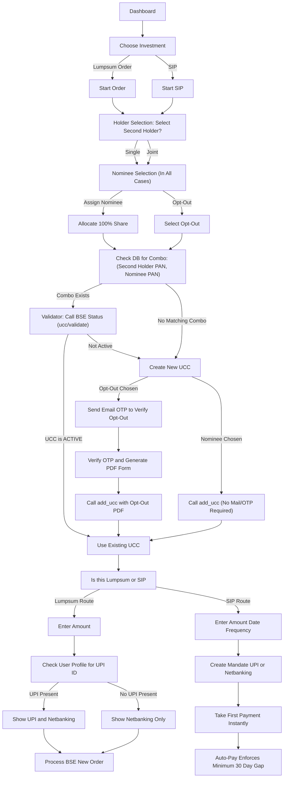

# Exact Onboarding Flow (Live Behavior)

## Product flow flowchart

## Step-by-Step Breakdown

### 1. PAN Page (Contact & Verification)
- User lands here needing to verify PAN.
- If they signed up with Email, we ask for a Phone number. If the phone is Indian (+91), we OTP verify it. If Foreign, we save it directly (bypass OTP).
- Submit PAN to Cashfree. Cashfree returns identity and, sometimes, an address from the PAN registry.
- `UserStatus` advances to `bank`.

### 2. Primary Address Confirmation
- Driven by `OnboardingRouter` parsing the `bank` status state. The first step is the `AddressOnboardingPage`.
- It pulls the raw `pan_address` snapshot captured during Step 1.
- If the PAN registry returned a real address, the form is pre-filled.
- *Cashfree Edge-Case:* For many users, Cashfree returns an empty/blank address from the Indian income tax registry. When this happens, a blue banner alerts the user they need to type it in manually.
- The user submits their primary correspondence address.

### 3. Bank & Residency Selection
- User navigates forward from Address into the Bank collection.
- **Mode 1 (UPI)**: Penny drops a VPA.
- **Mode 2 (Manual)**: Validates Account number + IFSC through Cashfree.
- User selects their `investor_residency` alongside the bank:
  - `Resident Individual (RI)`
  - `NRI — NRE`
  - `NRI — NRO`
- `UserStatus` advances to `profile` upon successfully verifying and saving the bank details.

### 4. Residency vs. Address Mapping (The "Few More Details" Page)
When the user arrives at the final `ProfileOnboardingPage`, the system evaluates the **Primary Address Country** against the **Bank Residency**:

*   **Case 1: User is Resident (RI) but saved a Foreign Primary Address.**
    *   *Result:* They cannot proceed to "few more details" until they provide an Indian Address in the amber correction block at the top. The foreign address is discarded for RI.
*   **Case 2: User is NRI (NRE/NRO) and saved an Indian Primary Address.**
    *   *Result:* The Indian address is kept as their secondary Indian connection. They are forced to provide their Overseas (Foreign) address to proceed.
*   **Case 3: User is NRI (NRE/NRO) and saved a Foreign Primary Address.**
    *   *Result:* The Foreign address is kept as their correspondence. They are forced to provide an Indian address as a secondary requirement.
*   **Case 4: User is Resident (RI) and saved an Indian Primary Address.**
    *   *Result:* Perfect match. No corrections needed.

Once the address logic is satisfied, the user proceeds to the **"Few more details"** form to finish:
- Personal Details (Father's name, PEP status, Occupation, etc.)
- Income Slab & Net Worth.
- Signature Pad.
- Submitting this completes onboarding and advances `UserStatus` to `ucc` (or `profile` complete), taking them to the Dashboard.

## Route Gating & Safety
The `OnboardingRouter` entirely governs navigation based on backend `UserStatus`:
- If you are on `pan` string, you cannot physically visit `/onboarding/bank`.
- If you complete `profile`, you cannot get pushed back into the onboarding cycle from the homepage, eliminating infinite redirect loops.

---

# Investment & Trading Flows (Post-Dashboard)

Once the user is on the Dashboard (having completed Onboarding), they can choose to initiate either a Lumpsum **Order** or a **SIP**.

## Trade/SIP Flowchart

## Details & Logic breakdown

### 1. Holder and Nominee Rules
Whether selecting Order or SIP, the user first establishes the ownership of the new investment:
- **Holder Rule:** User can invest individually or jointly by adding a secondary holder.
- **Nominee Rule:** Out of all holders tied to the profile, any holder *not* currently acting as a primary or secondary owner for this specific trade can be chosen as the nominee. Alternatively, the user can explicitly choose to **Opt-Out**.

### 2. The UCC Combination Check & Activation
Because BSE registers accounts ("UCCs") based on the exact combination of Account Nature (Single/Joint) + Holders + Nominee, the backend performs a strict check:
- **Combo Lookup:** Searches the database for a matching `second_holder_pan` and `nominee_pan` (including nulls for single/opt-out cases).
- **Validation:** If that exact combination exists, the system calls the **BSE Validator** (`api/v2/ucc/validate/`).
- **Reuse vs. Creation:**
  - **If Active:** Bypass creation and proceed with the existing Client Code.
  - **If Not Active / Missing:** Proceed to `CreateUCCBranch`.
- **Nominee Verification (OTP Rules):**
  - **Email Required:** Only when a user chooses to **Opt-Out** of nomination. An Email OTP is sent to verify the opt-out intent before generating the BSE-mandated PDF.
  - **No Mail Required:** If a standard nominee is assigned, no verification mail is triggered; the system proceeds directly to `add_ucc`.

### 3. Payment Method Divergence
Once a valid, active UCC is confirmed or created, the UX splits based on the product type:

#### A. Lumpsum (Order) Flow
- The user provides the intended order Amount.
- The system checks the user's profile for an existing, verified **UPI ID** (saved during Bank onboarding).
- If a UPI ID exists, both **UPI** and **Netbanking** payment options are presented.
- If no UPI ID is available, only the **Netbanking** option is rendered.
- Submitting finalizes the order (`api/order_new`) and generates the payment link.

#### B. SIP Registration & Auto-Pay Flow
- In addition to Amount, the user must specify Date and Frequency.
- The user registers an NACH e-Mandate directly tied to their UPI or Netbanking. **Important:** Each SIP requires its own separately registered mandate.
- The SIP is processed via `api/sxp_register` utilizing the "First Order Today" parameter:
  - The first installment/payment is deducted **instantaneously** on the day of creation.
  - The auto-deduction (mandate draw) for subsequent payments enforces a **Minimum 30-Day Gap** from the creation date.
  - *Example 1 (Gap Met):* User creates SIP on **April 27th** and chooses **April 27th** as the SIP Date. First payment deducts instantly on April 27th. The second payment triggers on **May 27th**.
  - *Example 2 (Gap Not Met):* User creates SIP on **April 27th** but chooses **May 5th** as the SIP Date. First payment deducts instantly on April 27th. Because May 5th is less than 30 days away, the second payment skips May and will trigger on **June 5th**.
